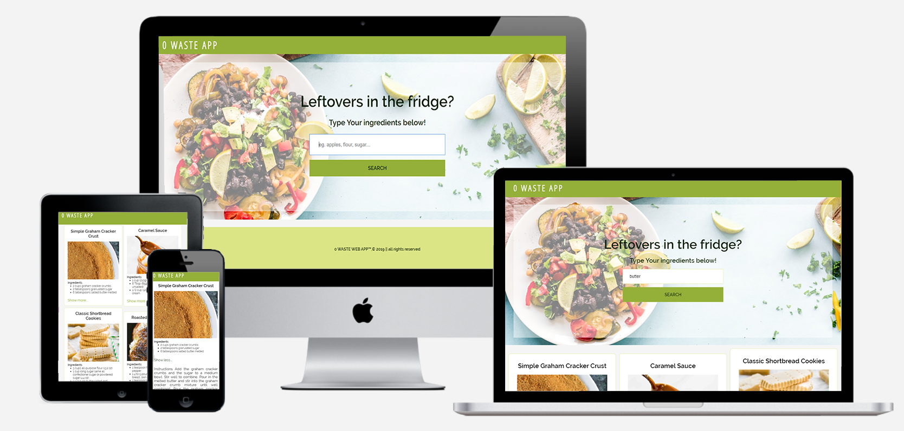

# 0 WASTE WEB APP



## Welcome!
Our app was created to help you use all the leftovers or raw products you have. Simply type your ingredients to a search bar and hit enter! Take care of our planet and stop wasting your food :) 

### Technologies
* HTML
* CSS
* JavaScript

### Tools
* Babel
* Webpack

### Sources
https://rapidapi.com/spoonacular/api/recipe-food-nutrition?endpoint=55e1b88fe4b0a29b2c36074d

# What do you need to run our app?

#### Sadly, you have to become a subscriber of an API we are using, link provided above.

### Firstly... 
Create in root folder:
```
variables.json
```
then, create object with key - API_KEY and assign to it your API_KEY

```
{
    "API_KEY" : "your_api_key" 
}
```
### Installation

```
npm install
```

### Build Prod Version

```
npm run build
```

### Start Dev Server

```
npm run dev
```

## Issues and to-do:
* Fixing recipes display
## Plans for future development: